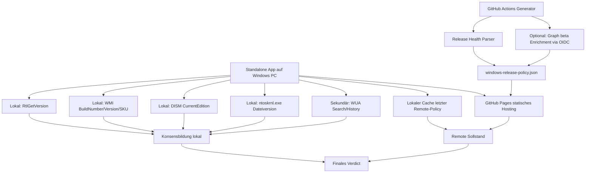
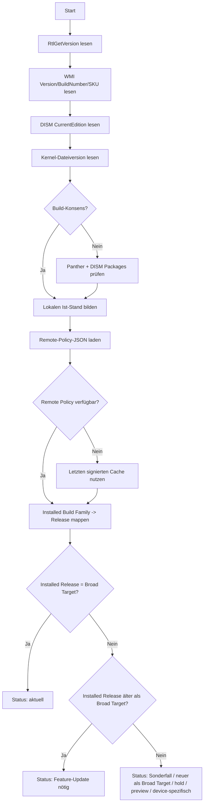

# Robuste hybride Erkennung des echten Windows Releases und des aktuellen Broad-Fleet-Zielstands

## Executive Summary

Für dein Zielbild würde ich **nicht** mehr versuchen, die „Wahrheit“ aus `ProductName`, `Caption`, `DisplayVersion` oder ähnlichen Registry-nahen Feldern zu ziehen. Genau dort entstehen die von dir beschriebenen Fehllagen: In deinem eigenen Testlauf wurde lokal eine Produktbezeichnung im Sinne von **Windows 10 Pro** gemeldet, während dieselbe Ausgabe gleichzeitig auf **25H2** und einen **26200er-Build** hinwies. Das ist ein starkes Indiz dafür, dass Marketing-/Beschriftungsfelder lokal veraltet oder inkonsistent sein können, obwohl Build- und Release-Signale bereits klar Windows 11 entsprechen. fileciteturn0file0

Die belastbare lokale Wahrheit für eine Standalone-App ist deshalb: **Build zuerst, Edition separat, Marketingname zuletzt ableiten**. Lokal solltest du primär auf **`RtlGetVersion`**, **`Win32_OperatingSystem.Version/BuildNumber/OperatingSystemSKU`**, **`DISM /Online /Get-CurrentEdition`**, **Dateiversionen zentraler Systemdateien wie `ntoskrnl.exe`** und – als Audit-/Konsistenzspur – **Panther-/Setup-Logs** sowie **DISM-Paketinformationen** setzen. `GetVersionEx` ist dafür ausdrücklich ungeeignet, weil sein Verhalten seit Windows 8.1 manifestabhängig ist, und `NtQuerySystemInformation` ist für diesen Zweck noch schlechter, weil Microsoft es als intern und änderbar beschreibt. citeturn29view2turn31view2turn31view3turn12view6turn31view4turn31view0turn12view2turn34view1turn12view5turn14view0

Für die **remote Wahrheit** über den „breiten“ aktuellen Zielstand gibt es nach meiner Recherche **keine saubere anonyme Microsoft-API**, die dir direkt in einem einzigen, dokumentierten JSON-Feld sagt: „Das ist die Standard-Zielversion für bestehende Windows-11-Pro-Geräte in der Breite.“ Die **nächstbeste offizielle öffentliche Quelle** ist die **Windows-11-Release-Health-Seite**. Microsoft selbst schreibt dort sogar, dass IT-Admins für programmgesteuerten Zugriff die **Windows Updates API in Microsoft Graph** verwenden sollen. Gleichzeitig zeigt dieselbe Seite Stand **27.05.2026** klar: **25H2** ist die aktuelle normale Windows-11-GA-Version für bestehende Geräte, während **26H1** zwar existiert, aber laut Note **nur neue Geräte Anfang 2026** unterstützt und **nicht** als direktes Featureupdate für vorhandene 24H2-/25H2-Geräte gedacht ist. Genau dein gewünschter Sonderfall ist damit offiziell belegbar. citeturn28view0turn35view2turn35view1

Daraus folgt die klare Empfehlung: **Shippe eine hybride Architektur**. Die **Standalone-App** bestimmt lokal den echten installierten Zustand **ohne Registry-ProductName als Primärsignal**. Zusätzlich konsumiert sie eine **kleine, signierte JSON-Metadatei**, die du per **GitHub Actions + GitHub Pages** automatisch erzeugen und veröffentlichen kannst. Als Generatorsource dient primär die **öffentliche Release-Health-Seite**, optional sekundär und enrichend **Microsoft Graph beta** über **OIDC/Federated Identity**, aber **nicht** direkt aus der Desktop-App heraus. GitHub Pages ist statisches Hosting; GitHub Actions kann zeitgesteuert laufen, OIDC in Azure nutzen und sogar ohne Subscription-Context mit `allow-no-subscriptions: true` tenantweit Graph-Tokens holen. Allerdings können `schedule`-Runs verzögert werden und in Public-Repos nach 60 Tagen Inaktivität deaktiviert werden. citeturn8view4turn7view0turn8view0turn8view1turn8view2turn8view3turn47view3turn47view2

Mein Gesamturteil ist deshalb eindeutig: **Bestes Design = lokale Build-/Edition-Feststellung + serverseitig generierte Remote-Policy-Datei**. **WUView/WUA** bleibt nützlich, aber nur **sekundär**: als Signal, was Windows Update aktuell anbietet oder historisch installiert hat, nicht als einziges Orakel dafür, ob ein Gerät von 24H2 auf 25H2 gehoben werden müsste. WUView selbst beschreibt seine Abhängigkeit von der Windows Update Agent API und weist darauf hin, dass es nur das anzeigen kann, was WUA liefert; zusätzlich werden Updateangebote durch Gerätezustand, Policies und Schutzmechanismen beeinflusst. citeturn54view0turn54view1turn32view1turn32view2turn33view1turn36view1turn39view0

## Was lokal als Wahrheit taugt

Die wichtigste architektonische Entscheidung ist, **lokale State-Erkennung von lokaler Beschriftung zu trennen**. `Win32_OperatingSystem` ist nützlich, aber nicht jede Eigenschaft darin ist gleich wertvoll: Microsoft dokumentiert `BuildNumber` ausdrücklich als präzisere Versionsinformation als Produkt-Release-Namen, während `Caption` nur eine kurze, lokalisierbare Beschreibung ist. Genau deshalb ist `Caption` für „Windows 11 Pro“ als **Anzeigehilfe** brauchbar, aber nicht als **Wahrheitsanker**. Dasselbe gilt praktisch für `systeminfo`, das ebenfalls nur detaillierte Konfigurationsinformationen anzeigt, aber kein besonders privilegierter Wahrheitskanal ist. citeturn31view4turn31view5turn29view4

Das zuverlässigste Primärsignal für den **laufenden OS-Stand** ist `RtlGetVersion`: Microsoft dokumentiert die Funktion als Abruf der Versionsinformationen des **derzeit ausgeführten Betriebssystems**. Im Gegensatz dazu ist `GetVersionEx` seit Windows 8.1 manifestabhängig und kann für nicht korrekt manifestierte Anwendungen nur ältere Versionswerte zurückgeben. `NtQuerySystemInformation` wiederum beschreibt Microsoft als intern, release-abhängig und nur im Ausnahmefall dynamisch zu linken; genau deshalb sollte es für Release-Erkennung in Produktcode **nicht** die Basis sein. citeturn29view2turn29view3turn31view2turn31view3turn12view6

Für die **Edition** ist `DISM /Online /Get-CurrentEdition` in der Praxis sehr brauchbar, weil DISM die aktuell laufende Windows-Edition selbst ausgibt. Ergänzend kann `GetProductInfo` bzw. `OperatingSystemSKU` aus `Win32_OperatingSystem` herangezogen werden, wenn du maschinenlesbare SKU-/Produktcodes willst. Wichtig ist dabei: Diese Methoden helfen dir bei **Home/Pro/Enterprise/Pro for Workstations**, aber **nicht** bei der reinen H2/H1-Releasebestimmung. Dafür brauchst du weiterhin den Build. citeturn12view2turn31view0turn31view1turn30view0

Wenn du **ohne Registry-UBR** auskommen willst, ist die **Dateiversion eines zentralen OS-Binaries** eine sehr gute zweite Achse. Die Windows-Version-APIs `GetFileVersionInfoSize`, `GetFileVersionInfo` und `VerQueryValue` liefern die Versionsressourcen einer Datei; für deine Zwecke eignet sich vor allem `ntoskrnl.exe` als OS-near Plausibilisierungsquelle. Das ist kein offiziell als „kanonisch“ bezeichnetes Windows-Release-API, aber es ist in der Praxis ein sehr starkes, dateisystemgestütztes Gegengewicht zu registry-nahen Feldern. Ich würde es deshalb als **Konsenssignal** verwenden: Wenn `RtlGetVersion`, WMI-Build und Kernel-Dateiversion zusammenpassen, ist die lokale Wahrheit sehr wahrscheinlich korrekt. citeturn34view0turn34view1

**Panther-/Setup-Logs** und **DISM-Paketinformationen** sind die richtige dritte Ebene. Microsoft dokumentiert die Panther-Logorte (`%WINDIR%\Panther`, `$Windows.~BT\Sources\Panther` usw.) und beschreibt `setupact.log` als zentrale Logdatei für Setup-Aktionen. Zusätzlich kann `DISM /Online /Get-Packages` grundlegende Informationen über installierte Pakete anzeigen; daraus lassen sich installierte LCUs/KBs und damit Build-Revisionsstände ableiten. Diese Daten sind hervorragend für Audit, Forensik und Konfliktlösung, aber sie sind schwerfälliger als `RtlGetVersion` und DISM Edition. citeturn11view0turn12view5turn14view0

WUA gehört lokal **nur auf Rang zwei**. Die offiziellen WUA-Methoden `Search` und `QueryHistory` sind nützlich, um angebotene oder historisch installierte Updates zu sehen. `IAutomaticUpdates::get_ServiceEnabled` sagt dir sogar, ob die benötigten Automatic-Updates-Komponenten verfügbar sind. Aber WUA beantwortet primär die Frage „was sieht/weiß das Update-System gerade?“, nicht „was ist objektiv der wahre Releasezweig dieses OS?“. Genau deshalb ist deine Grundidee richtig: **WUA immer abfragen, aber nie allein vertrauen**. citeturn32view1turn32view2turn33view1turn54view0turn54view1

### Priorisierte lokale Techniken

| Technik | Wofür sie taugt | Stärken | Schwächen | Urteil |
|---|---|---|---|---|
| `RtlGetVersion` | Laufender OS-Build/Version | Direktes API für das aktuell laufende OS; nicht manifestabhängig wie `GetVersionEx` | Liefert keine Marketing-Edition | **Primärsignal für Build** |
| `Win32_OperatingSystem.Version` + `BuildNumber` | Zweitquelle für Build | WMI/CIM, remote/administrativ gut nutzbar; `BuildNumber` ist dokumentiert | `Caption` ist lokalisiert und nicht belastbar für Marketingname | **Primärsignal für Build-Konsens** |
| `DISM /Online /Get-CurrentEdition` | Edition | Supportbares OS-Tool, klarer Editionswert | Kein H2/H1-Release | **Primärsignal für Edition** |
| `GetProductInfo` / `OperatingSystemSKU` | SKU, Produktcode | Gut für Pro/Enterprise/Education-Differenzierung | Legacy-artige API, Releasezweig nicht ableitbar | **Sekundärsignal für Edition** |
| `ntoskrnl.exe`-Dateiversion | UBR-/Build-Plausibilisierung | Registry-frei, dateibasiert | Kein offizieller „Marketingname“-Kanal | **Starkes Kontrolldatum** |
| Panther-/Setup-Logs | Zuletzt geplantes/gelaufenes Feature-Upgrade | Forensisch wertvoll, hilft Konflikte aufzulösen | Parsing aufwendiger, nicht immer vorhanden/relevant | **Audit-/Fallback-Ebene** |
| `DISM /Online /Get-Packages` | Installierte LCU/KBs | Servicing-nah, gut für KB-/LCU-Abgleich | Parsing nötig | **Audit-/Fallback-Ebene** |
| WUA `Search` / `QueryHistory` | Angebotene/ installierte Updates | Spiegelt das tatsächliche Update-Subsystem | Kann durch Holds, Policies, Deferrals, Störungen beeinflusst sein | **Sekundärsignal** |
| `GetVersionEx` | Früher Standard | Bekannt | Manifestabhängig, von Microsoft abgeraten | **Nicht verwenden** |
| `NtQuerySystemInformation` | Interne Kernelinfos | Theoretisch mächtig | Intern, änderbar, nicht supportbar als Release-API | **Nicht verwenden** |

Die Gewichtung oben verdichtet Microsofts API-Dokumentation zu `RtlGetVersion`, `GetVersionEx`, `Win32_OperatingSystem`, `GetProductInfo`, `systeminfo`, DISM, Panther-Logs und WUA. citeturn29view2turn31view2turn31view3turn31view4turn31view5turn31view0turn12view2turn14view0turn12view5turn32view1turn32view2turn33view1turn12view6turn29view4

## Welche Remotesourcen wirklich tragfähig sind

Für den **breiten Zielstand** ist die **deutsche Windows-11-Release-Health-Seite** derzeit die wichtigste öffentliche Quelle. Sie dokumentiert die jährliche Feature-Update-Kadenz von Windows 11, die monatlichen kumulativen Sicherheitsupdates und – entscheidend für deinen Sonderfall – die derzeitigen Versionen nach Wartungskanal. Auf der Seite vom **27.05.2026** stehen für Windows 11 im Kanal für allgemeine Verfügbarkeit unter anderem **25H2 mit Build 26200.8457** und **24H2 mit Build 26100.8457**. Gleichzeitig enthält dieselbe Seite eine Note, dass **26H1** zwar neue Geräte Anfang 2026 unterstützt, aber **nicht** als Funktionsupdate für vorhandene Geräte bzw. **nicht** als direktes Update von 24H2 oder 25H2 gedacht ist. Für dein gewünschtes Verhalten ist das der offizielle Hebel. citeturn28view0turn29view0turn29view1

Microsoft verweist auf genau dieser Release-Health-Seite ausdrücklich darauf, dass IT-Admins für programmgesteuerten Zugriff die **Windows Updates API in Microsoft Graph** nutzen sollen. Die Graph-Dokumentation zeigt für `/admin/windows/updates/catalog/entries`, dass der Endpunkt **Feature-Update- und Quality-Update-Katalogeinträge** liefern kann, OData-Parameter wie `$filter`, `$orderby`, `$select`, `$skip` und `$top` unterstützt und App-Berechtigungen wie `WindowsUpdates.Read.All` kennt. Gleichzeitig markiert Microsoft diese APIs klar als **`/beta`** und sagt explizit, dass die Nutzung in Produktionsanwendungen **nicht unterstützt** ist. Damit ist Graph ein **sehr gutes Backend-Enrichment**, aber kein sauberer finaler Vertrag für den direkten Desktop-Client. citeturn35view2turn35view1turn35view3turn35view4turn4view5turn48view0turn48view1turn50view0turn50view1

Die **Windows Update for Business-Berichte** sind dagegen nicht das, was du suchst. Offiziell sind sie eine cloudbasierte Compliance-/Berichtslösung für **deine** Entra-verbundenen Geräte und sammeln Diagnose-/Statusdaten in Azure/Log Analytics. Sie sind sehr nützlich, wenn du Fleet-Compliance visualisieren willst, aber sie sind **keine** anonyme globale „was ist jetzt der breite Standardrelease“-API. citeturn53view1turn53view0

**Wsusscn2.cab** und WUA-Offline-Scanning helfen ebenfalls nicht direkt für deinen Hauptfall. Microsoft dokumentiert klar, dass `Wsusscn2.cab` Informationen zu **sicherheitsrelevanten Updates** enthält und für Offline-Scans gegen Sicherheitsupdates gedacht ist. Das ist gut für Security-Compliance ohne Internet, aber nicht für die Frage „ist dieses Gerät noch auf 24H2 statt 25H2?“. Featurerelease-Zielstände bekommst du daraus nicht sauber. citeturn43view1turn43view0

Bei den Open-Source-Repos sind für dich vor allem drei Projekte relevant. **WindowsOSBuild** ist interessant, weil es Release-Health-/Update-History-Daten und Atom-Feeds in ein scripting-freundliches Format gießt; das bestätigt, dass diese öffentlichen Quellen maschinell nutzbar sind. **WUView** ist nützlich als Beispiel, wie WUA-History und Event Logs zusammengedacht werden können, weist aber selbst darauf hin, dass es nur darstellen kann, was WUA liefert. **PSWindowsUpdate** ist nützlich als Operations-/Admin-Tooling rund um Windows Update, inklusive WUfB-Zielrelease-Steuerung und Offline-MSU-Download aus dem Catalog, ist aber ebenfalls kein offizieller globaler Broad-Fleet-Metadatendienst. citeturn55view0turn54view3turn54view0turn54view1turn41view0turn55view2turn55view3

### Vergleich aller Kandidaten

Die folgende Tabelle verdichtet die tragfähigsten lokalen und remote Kandidaten aus offizieller Microsoft-Dokumentation und den relevanten GitHub-Repos. citeturn28view0turn35view2turn54view3turn54view0turn41view0turn43view1turn53view1

| Quelle | Typ | Captcha | Auth nötig | Zuverlässigkeit | Edge-Case-Risiken | Wartungskosten | Beispielaufruf / API |
|---|---|---:|---:|---|---|---|---|
| `RtlGetVersion` | Lokal | Nein | Nein | Hoch | Keine Edition, nur Version/Build | Niedrig | `RtlGetVersion()` |
| `Win32_OperatingSystem.Version/BuildNumber` | Lokal | Nein | Nein | Hoch | `Caption` kann irreführend/lokalisiert sein | Niedrig | `SELECT Version, BuildNumber, OperatingSystemSKU FROM Win32_OperatingSystem` |
| `DISM /Online /Get-CurrentEdition` | Lokal | Nein | Nein | Hoch für Edition | Kein H2/H1-Release | Niedrig | `dism /online /get-currentedition` |
| `GetProductInfo` / `OperatingSystemSKU` | Lokal | Nein | Nein | Mittel bis hoch | SKU-Interpretation nötig | Mittel | `GetProductInfo(...)` |
| `ntoskrnl.exe`-Dateiversion | Lokal | Nein | Nein | Mittel bis hoch | Mehr Plausibilisierung als offizieller Release-Kanal | Mittel | `GetFileVersionInfo("C:\\Windows\\System32\\ntoskrnl.exe")` |
| Panther-/Setup-Logs | Lokal | Nein | Nein | Mittel | Logmuster ändern sich; nicht immer relevant | Mittel | `%WINDIR%\\Panther\\setupact.log` |
| `DISM /Online /Get-Packages` | Lokal | Nein | Nein | Mittel | Paket-/KB-Parsing nötig | Mittel | `dism /online /get-packages /format:list` |
| WUA `Search` / `QueryHistory` | Lokal | Nein | Nein | Mittel | Holds, Deferrals, Policies, Service-Probleme | Niedrig bis mittel | `Microsoft.Update.Session().CreateUpdateSearcher()` |
| `Wsusscn2.cab` | Remote+lokal | Nein | Nein | Niedrig für Feature-Release-Frage | Nur Security-Updates | Mittel | `AddScanPackageService(..., "wsusscn2.cab")` |
| Windows 11 Release Health | Remote | Nein | Nein | Hoch für Broad-Target | HTML-/Tabellenstruktur kann sich ändern; Ausnahmehinweise stehen teils im Prosa-Text | Mittel | `GET learn.microsoft.com/.../windows11-release-information` |
| Microsoft Graph Windows Updates Catalog beta | Remote | Nein | **Ja** | Hoch strukturiert, aber Beta | `/beta`, produktiv nicht supported; Tenant/Berechtigungen nötig | Mittel bis hoch | `GET /beta/admin/windows/updates/catalog/entries` |
| WUfB Reports | Remote | Nein | **Ja** | Hoch für **deine** Flotte | Kein globaler Broad-Target-Dienst | Hoch | Azure/Log Analytics/WUfB reports |
| WindowsOSBuild | Community/GitHub | Nein | Nein | Mittel bis hoch | Community-Wartung; hängt an Microsoft HTML/Feeds | Mittel | `Get-LatestOSBuild -OSName Win11 -OSVersion 25H2` |
| WUView | Community/GitHub | Nein | Nein | Mittel | Nur WUA/Eventlog-Sicht | Niedrig | WUA-History/Eventlog Viewer |
| PSWindowsUpdate | Community/GitHub | Nein | Nein | Mittel | Admin-/Operationsfokus, nicht globaler Truth-Service | Mittel | `Get-WindowsUpdate`, `Get-WUHistory`, `Set-WUSettings` |

## Empfohlene Hybridarchitektur

Die stabilste Lösung für eine **Standalone-App mit minimalen Zukunftsupdates** ist **zweistufig**. Die App selbst bestimmt lokal den installierten Zustand robust und registry-arm. Für die Frage „was ist aktuell der breit ausrollbare Sollstand?“ lädt sie **eine kleine JSON-Metadatei**, die du serverseitig generierst. Damit verschiebst du die fragile Logik – HTML-Parsing, Graph-Enrichment, Ausnahmebehandlung wie 26H1 – **aus dem Client heraus** in einen einfach austauschbaren Generator. Das ist im Ergebnis deutlich enterprise-tauglicher als in jeder Client-Version neue Sonderfälle hart zu codieren. citeturn28view0turn35view2turn54view3

Die Erzeugung dieser JSON-Datei kannst du sehr gut auf **GitHub Actions + GitHub Pages** legen. GitHub Pages ist ein **statischer Hosting-Dienst**, perfekt für eine kleine `windows-release-policy.json`. GitHub Actions lässt sich per `schedule` automatisieren, aber GitHub dokumentiert auch die zwei wichtigsten Caveats: geplanter Lauf kann bei hoher Last verzögert oder sogar fallengelassen werden, und in **öffentlichen Repositories** werden geplante Workflows nach **60 Tagen ohne Aktivität** automatisch deaktiviert. Für einen Metadatenfeed ist das meist akzeptabel, solange der Client immer einen lokal gecachten letzten Stand mit Ablaufdatum behält. citeturn8view4turn8view2turn8view3

Wenn du **nur** die öffentliche Release-Health-Seite verwendest, kann der Generator **komplett secretless** laufen. Wenn du zusätzlich **Graph beta** als Enrichment möchtest, solltest du das **nicht** direkt in eine Desktop-App einbauen. Microsoft unterscheidet klar zwischen **public clients** und **confidential clients**: Desktop-Apps sind public clients und können Geheimnisse nicht sicher aufbewahren; Microsoft rät außerdem ausdrücklich davon ab, Secrets im Quellcode zu hardcodieren. Genau deshalb ist ein Build-/Publish-Workflow mit **OIDC/Federated Credentials** der richtige Ort für Graph. GitHub dokumentiert OIDC für Azure explizit als Weg, Azure-Zugriff **ohne langlebige GitHub-Secrets** zu erhalten. citeturn47view3turn47view4turn7view0

Für den Graph-Zugriff aus GitHub Actions ist wichtig: Du brauchst **kein Azure-Subscription-Abo**, wenn du nur tenantweite Graph-Aufrufe machen willst. Das `azure/login`-Action unterstützt `allow-no-subscriptions: true`, und per Azure CLI kannst du dann ein MS-Graph-Token mit `az account get-access-token --resource-type ms-graph` holen. Das ist exakt das, was du für einen reinen Metadaten-Sammler brauchst. citeturn8view0turn8view1

### Zielbild



### Was der Feed enthalten sollte

Der Feed sollte **nicht** nur rohe Tabellenzeilen spiegeln, sondern bereits eine **Policy-Entscheidung** für bestehende Geräte enthalten. Ein gutes Schema wäre etwa:

```json
{
  "generated_at_utc": "2026-05-27T06:15:00Z",
  "source": {
    "release_health_locale": "de-de",
    "release_health_url": "https://learn.microsoft.com/de-de/windows/release-health/windows11-release-information",
    "graph_enriched": true
  },
  "windows11": {
    "broad_target_existing_devices": {
      "version": "25H2",
      "build_family": 26200,
      "latest_build": "26200.8457",
      "servicing_option": "Kanal für allgemeine Verfügbarkeit",
      "reason": "26H1 existiert, ist laut Release-Health-Note aber nicht als Featureupdate für vorhandene 24H2/25H2-Geräte gedacht."
    },
    "excluded_for_existing_devices": [
      {
        "version": "26H1",
        "build_family": 28000,
        "reason": "nur neue Geräte Anfang 2026"
      }
    ],
    "supported_build_families": {
      "26200": "25H2",
      "26100": "24H2",
      "22631": "23H2"
    }
  }
}
```

Damit läuft die eigentliche Standalone-App extrem schlank: Sie muss nur **lokale Wahrheit** ermitteln, diesen Feed laden und eine Entscheidung treffen. Die schwierigere Semantik – etwa wann eine Version wie 26H1 ausgeschlossen werden muss – liegt im Generator und nicht in tausenden installierten Clients. Diese Trennung ist die wirkliche Zukunftssicherheit.

## Entscheidungsalgorithmus und Fallbacks

Die App sollte sich lokal **nicht** fragen „Wie nennt Windows sich?“ sondern „Welcher Build läuft wirklich, welche Edition ist installiert, und was ist laut Remote-Policy der Sollstand?“. Das reduziert die gesamte Logik sehr stark. Die folgende Logik ist aus meiner Sicht die belastbarste.

### Entscheidungsfluss



### Konkrete Regeln

Zuerst bestimmst du **den effektiven Build**. Dafür bildest du einen Konsens aus `RtlGetVersion`, `Win32_OperatingSystem.BuildNumber` und der Dateiversion von `ntoskrnl.exe`. Stimmen alle drei überein, nimmst du diesen Build. Gibt es Abweichungen, ziehst du Panther-/Setup-Logs und DISM-Paketinformationen hinzu. Die eigentliche Release-Bezeichnung wie `25H2` leitest du **nicht lokal aus der Registry** ab, sondern aus der **Build-Familie** via Remote-Policy-Mapping. citeturn29view2turn31view4turn34view1turn12view5turn14view0

Die **Edition** bestimmst du separat. Primär nimmst du `DISM /Get-CurrentEdition`, sekundär `OperatingSystemSKU` oder `GetProductInfo`. Den finalen Marketingtext generierst du dann selbst, etwa als „Windows 11 Pro“, wenn Build-Familie und Remote-Map auf Windows 11 zeigen und die Edition `Professional` lautet. Damit entkoppelst du dich vollständig von kaputten lokalen Beschriftungen. citeturn12view2turn31view0turn30view0

Für den Remote-Sollstand gilt: Wenn der Feed erfolgreich geladen wurde, ist dessen `broad_target_existing_devices` maßgeblich. Wenn der Feed fehlt, nutzt die App den **zuletzt signierten Cache** weiter, aber mit einem Warning-Status wie `REMOTE_POLICY_STALE`. Erst wenn kein Feed und kein Cache da sind, fällt die App auf ein **eingebettetes last-known-good Mapping** zurück, das beim App-Release mitgeliefert wurde. Diese dritte Ebene ist nicht die bevorzugte Wahrheit, aber sie verhindert Ausfälle auf frisch geimaged Geräten ohne Netz oder bei Hostingproblemen.

WUA wird in jedem Lauf mit abgefragt, aber nur als **Hinweis**. Wenn WUA kein Featureupdate auf 25H2 anbietet, die lokale Build-Familie aber auf 24H2 steht und die Remote-Policy `25H2` als Broad Target ausweist, dann lautet das Verdict **nicht** „alles gut“, sondern etwa: `FEATURE_UPDATE_EXPECTED_BUT_NOT_OFFERED_BY_WUA`. Genau damit deckst du deine realen Fälle von Safeguards, Deferrals, fehlerhafter WU-Konfiguration oder kaputtem Update-Agent ab. WUViews eigenes Readme und die WUA-Doku stützen diese Einschätzung. citeturn54view0turn54view1turn32view1turn32view2turn33view1turn36view1turn39view0

## Python-Beispiele

Die folgenden Snippets sind absichtlich so aufgebaut, dass sie in einer normalen Windows-Desktop-Python-Umgebung funktionieren. Annahmen: **Python 3.10+**, **`pywin32`**, **`requests`** und optional **`beautifulsoup4`** sind installierbar; Netzwerkausgang ist erlaubt.

### Lokale Primärsignale

```python
from __future__ import annotations

import ctypes
import os
import re
import subprocess
from ctypes import wintypes
from dataclasses import dataclass, asdict
from pathlib import Path

import win32api
import win32com.client


@dataclass
class LocalSignals:
    rtl_version: str | None = None
    rtl_build: int | None = None
    wmi_version: str | None = None
    wmi_build: int | None = None
    wmi_caption: str | None = None
    wmi_sku: int | None = None
    os_architecture: str | None = None
    dism_current_edition: str | None = None
    product_info_code: int | None = None
    kernel_file_version: str | None = None


class RTL_OSVERSIONINFOEXW(ctypes.Structure):
    _fields_ = [
        ("dwOSVersionInfoSize", wintypes.DWORD),
        ("dwMajorVersion", wintypes.DWORD),
        ("dwMinorVersion", wintypes.DWORD),
        ("dwBuildNumber", wintypes.DWORD),
        ("dwPlatformId", wintypes.DWORD),
        ("szCSDVersion", wintypes.WCHAR * 128),
        ("wServicePackMajor", wintypes.WORD),
        ("wServicePackMinor", wintypes.WORD),
        ("wSuiteMask", wintypes.WORD),
        ("wProductType", ctypes.c_ubyte),
        ("wReserved", ctypes.c_ubyte),
    ]


def rtl_get_version() -> tuple[str, int]:
    ntdll = ctypes.WinDLL("ntdll")
    func = ntdll.RtlGetVersion
    func.argtypes = [ctypes.POINTER(RTL_OSVERSIONINFOEXW)]
    func.restype = wintypes.ULONG

    info = RTL_OSVERSIONINFOEXW()
    info.dwOSVersionInfoSize = ctypes.sizeof(info)
    status = func(ctypes.byref(info))
    if status != 0:
        raise OSError(f"RtlGetVersion failed with NTSTATUS={status}")

    version = f"{info.dwMajorVersion}.{info.dwMinorVersion}.{info.dwBuildNumber}"
    return version, int(info.dwBuildNumber)


def wmi_os() -> dict:
    locator = win32com.client.Dispatch("WbemScripting.SWbemLocator")
    service = locator.ConnectServer(".", "root\\cimv2")
    rows = service.ExecQuery(
        "SELECT Caption, Version, BuildNumber, OperatingSystemSKU, OSArchitecture "
        "FROM Win32_OperatingSystem"
    )
    for row in rows:
        return {
            "caption": str(row.Caption) if row.Caption is not None else None,
            "version": str(row.Version) if row.Version is not None else None,
            "build": int(str(row.BuildNumber)) if row.BuildNumber is not None else None,
            "sku": int(row.OperatingSystemSKU) if row.OperatingSystemSKU is not None else None,
            "arch": str(row.OSArchitecture) if row.OSArchitecture is not None else None,
        }
    raise RuntimeError("Win32_OperatingSystem returned no rows")


def dism_get_current_edition() -> str | None:
    proc = subprocess.run(
        ["dism.exe", "/Online", "/Get-CurrentEdition"],
        capture_output=True,
        text=True,
        encoding="utf-8",
        errors="replace",
        check=False,
    )
    text = proc.stdout + "\n" + proc.stderr

    # Englisch + Deutsch tolerieren
    patterns = [
        r"Current Edition\s*:\s*(\S+)",
        r"Aktuelle Edition\s*:\s*(\S+)",
    ]
    for pattern in patterns:
        m = re.search(pattern, text, re.IGNORECASE)
        if m:
            return m.group(1).strip()
    return None


def get_product_info_code(major: int, minor: int) -> int | None:
    product_type = wintypes.DWORD()
    ok = ctypes.windll.kernel32.GetProductInfo(
        major, minor, 0, 0, ctypes.byref(product_type)
    )
    if not ok:
        return None
    return int(product_type.value)


def get_file_version(path: str) -> str | None:
    if not os.path.exists(path):
        return None

    info = win32api.GetFileVersionInfo(path, "\\")
    ms = info["FileVersionMS"]
    ls = info["FileVersionLS"]

    major = (ms >> 16) & 0xFFFF
    minor = ms & 0xFFFF
    build = (ls >> 16) & 0xFFFF
    ubr = ls & 0xFFFF
    return f"{major}.{minor}.{build}.{ubr}"


def collect_local_signals() -> LocalSignals:
    rtl_version, rtl_build = rtl_get_version()
    wmi = wmi_os()
    dism_edition = dism_get_current_edition()
    product_info = get_product_info_code(*map(int, rtl_version.split(".")[:2]))
    kernel_ver = get_file_version(r"C:\Windows\System32\ntoskrnl.exe")

    return LocalSignals(
        rtl_version=rtl_version,
        rtl_build=rtl_build,
        wmi_version=wmi["version"],
        wmi_build=wmi["build"],
        wmi_caption=wmi["caption"],
        wmi_sku=wmi["sku"],
        os_architecture=wmi["arch"],
        dism_current_edition=dism_edition,
        product_info_code=product_info,
        kernel_file_version=kernel_ver,
    )


if __name__ == "__main__":
    sig = collect_local_signals()
    print(asdict(sig))
```

Dieses Snippet vermeidet `GetVersionEx` bewusst und nutzt stattdessen `RtlGetVersion`, WMI-Builddaten, DISM-Edition und Dateiversionen. Genau diese Aufteilung folgt den offiziellen API-/Tool-Eigenschaften: `RtlGetVersion` für das laufende OS, `BuildNumber` als präzisere Versionsinformation, `Get-CurrentEdition` für Edition und die Version-APIs für Dateiversionen. citeturn29view2turn31view4turn12view2turn34view1

### Panther-Logs und DISM-Pakete als Audit-Ebene

```python
from __future__ import annotations

import os
import re
import subprocess
from pathlib import Path
from typing import Iterable


PANTHER_CANDIDATES = [
    Path(os.environ.get("WINDIR", r"C:\Windows")) / "Panther" / "setupact.log",
    Path(r"C:\$Windows.~BT\Sources\Panther\setupact.log"),
    Path(r"C:\$Windows.~BT\Sources\Rollback\setupact.log"),
]


def read_text_if_exists(path: Path) -> str | None:
    if not path.exists():
        return None
    return path.read_text(encoding="utf-8", errors="replace")


def latest_panther_release_hints() -> dict:
    hints: dict[str, str | list[str]] = {"files_checked": [], "matches": []}

    patterns = [
        r"(?i)\b(?:25H2|24H2|23H2|22H2|26H1)\b",
        r"(?i)\bOS build\s+(\d{5}\.\d+)\b",
        r"(?i)\bBuild\s+(\d{5}\.\d+)\b",
        r"(?i)\bKB\d{7}\b",
    ]

    for path in PANTHER_CANDIDATES:
        text = read_text_if_exists(path)
        hints["files_checked"].append(str(path))
        if not text:
            continue

        found = []
        for pattern in patterns:
            found.extend(m.group(0) for m in re.finditer(pattern, text))
        if found:
            hints["matches"].extend(found[:50])

    return hints


def dism_get_installed_packages() -> str:
    proc = subprocess.run(
        ["dism.exe", "/Online", "/Get-Packages", "/Format:List"],
        capture_output=True,
        text=True,
        encoding="utf-8",
        errors="replace",
        check=False,
    )
    return proc.stdout + "\n" + proc.stderr


def extract_latest_kbs_and_rollup_identity(dism_text: str) -> dict:
    kbs = re.findall(r"\bKB\d{7}\b", dism_text, flags=re.IGNORECASE)
    rollups = re.findall(r"Package_for_RollupFix[^\r\n]*", dism_text, flags=re.IGNORECASE)

    # Dedup, Reihenfolge grob beibehalten
    def uniq(seq: Iterable[str]) -> list[str]:
        seen = set()
        out = []
        for item in seq:
            key = item.lower()
            if key not in seen:
                seen.add(key)
                out.append(item)
        return out

    return {
        "kb_candidates": uniq(kbs)[:20],
        "rollup_package_candidates": uniq(rollups)[:20],
    }
```

Panther-Logs und DISM-Pakete sind hier bewusst als **Audit-/Konfliktauflösung** modelliert, nicht als Primärwahrheit. Microsoft dokumentiert Panther als zentrale Setup-Loglage und DISM als supportbaren Weg, Paketstände des laufenden OS abzufragen. citeturn11view0turn12view5turn14view0

### WUA sekundär abfragen

```python
from __future__ import annotations

import win32com.client


def wua_snapshot() -> dict:
    auto_update = win32com.client.Dispatch("Microsoft.Update.AutoUpdate")
    update_session = win32com.client.Dispatch("Microsoft.Update.Session")
    searcher = update_session.CreateUpdateSearcher()

    history_count = searcher.GetTotalHistoryCount()
    history_items = searcher.QueryHistory(0, min(history_count, 50))

    offered_titles = []
    try:
        result = searcher.Search("IsInstalled=0 and Type='Software'")
        for i in range(result.Updates.Count):
            offered_titles.append(str(result.Updates.Item(i).Title))
    except Exception as exc:
        offered_titles.append(f"<search failed: {exc!r}>")

    history_titles = []
    for item in history_items:
        history_titles.append(str(item.Title))

    return {
        "service_enabled": bool(auto_update.ServiceEnabled),
        "history_count": int(history_count),
        "recent_history_titles": history_titles[:20],
        "offered_update_titles": offered_titles[:50],
    }
```

WUA bleibt sinnvoll, weil `QueryHistory` den Ereignisverlauf und `Search` aktuelle Suchergebnisse liefert. `ServiceEnabled` ist zudem ein guter Gesundheitsindikator dafür, ob das lokale Update-Subsystem überhaupt einsatzfähig ist. Aber genau weil WUA nur das lokale Updateökosystem repräsentiert, gehört dieses Signal architektonisch hinter die Build-/Edition-Ermittlung. citeturn32view1turn32view2turn33view1turn54view0

## Remote-Abfragen

### Öffentliche Release-Health-Seite robust parsen

```python
from __future__ import annotations

import re
from dataclasses import dataclass
from typing import Any

import requests
from bs4 import BeautifulSoup


@dataclass
class ReleaseRow:
    version: str
    servicing_option: str
    latest_build: str
    raw: dict[str, Any]


def _norm(text: str) -> str:
    return re.sub(r"\s+", " ", text.replace("\xa0", " ")).strip()


def fetch_windows11_release_health(locale: str = "de-de") -> list[ReleaseRow]:
    url = f"https://learn.microsoft.com/{locale}/windows/release-health/windows11-release-information"
    headers = {
        "User-Agent": "Mozilla/5.0 (Windows NT 10.0; Win64; x64) WindowsReleasePolicyFetcher/1.0",
        "Accept-Language": "de-DE,de;q=0.9,en;q=0.8",
    }
    resp = requests.get(url, headers=headers, timeout=30)
    resp.raise_for_status()

    soup = BeautifulSoup(resp.text, "html.parser")

    target_table = None
    for table in soup.find_all("table"):
        headers = [_norm(th.get_text(" ", strip=True)) for th in table.find_all("th")]
        if any(h in headers for h in ("Neuester Build", "Latest build")):
            target_table = table
            break

    if target_table is None:
        raise RuntimeError("Keine Release-Health-Tabelle mit 'Neuester Build' gefunden.")

    headers = [_norm(th.get_text(" ", strip=True)) for th in target_table.find_all("th")]
    rows: list[ReleaseRow] = []

    for tr in target_table.find_all("tr")[1:]:
        tds = tr.find_all(["td", "th"])
        values = [_norm(td.get_text(" ", strip=True)) for td in tds]
        if len(values) != len(headers):
            continue

        row = dict(zip(headers, values))
        version = row.get("Version") or row.get("Version ")
        latest_build = row.get("Neuester Build") or row.get("Latest build")
        servicing_option = row.get("Wartungsoption") or row.get("Servicing option")

        if not version or not latest_build:
            continue

        # Nur H1/H2-artige Versionen
        if not re.match(r"^\d{2}H[12]$", version):
            continue

        rows.append(
            ReleaseRow(
                version=version,
                servicing_option=servicing_option or "",
                latest_build=latest_build,
                raw=row,
            )
        )

    if not rows:
        raise RuntimeError("Keine verwertbaren Windows-11-Zeilen aus Release Health extrahiert.")

    return rows


def choose_broad_target_existing_devices(rows: list[ReleaseRow]) -> ReleaseRow:
    # Diese Ausschlussliste gehört idealerweise in deinen serverseitig erzeugten Feed,
    # nicht dauerhaft hart in jeden Client.
    exclude_versions_for_existing_devices = {"26H1"}

    candidates = [
        r for r in rows
        if r.version not in exclude_versions_for_existing_devices
        and ("allgemeine Verfügbarkeit" in r.servicing_option.lower()
             or "general availability" in r.servicing_option.lower())
    ]
    if not candidates:
        raise RuntimeError("Keine Broad-Target-Kandidaten gefunden.")

    # 25H2 > 24H2 > 23H2 ...
    def version_key(v: str) -> tuple[int, int]:
        year = int(v[:2])
        half = int(v[-1])  # H1/H2
        return (year, half)

    return max(candidates, key=lambda r: version_key(r.version))
```

Diese Parser-Strategie ist passend, weil die Release-Health-Seite öffentlich erreichbar ist und Microsoft selbst sie als programmatisch relevante Quelle positioniert, zugleich aber für echte API-Nutzung auf Graph verweist. Genau deshalb ist sie ein guter **Feed-Generator-Input**, aber kein idealer direkter Dauervertrag im Client. citeturn28view0turn35view2

### Graph beta optional als Enrichment

```python
from __future__ import annotations

import requests


def fetch_graph_catalog_entries(access_token: str, top: int = 200) -> list[dict]:
    url = "https://graph.microsoft.com/beta/admin/windows/updates/catalog/entries"
    headers = {
        "Authorization": f"Bearer {access_token}",
        "Accept": "application/json",
    }
    params = {
        "$top": top,
        "$select": "id,displayName,releaseDateTime,@odata.type,version,buildNumber",
    }

    out = []
    next_url = url

    while next_url:
        resp = requests.get(
            next_url,
            headers=headers,
            params=params if next_url == url else None,
            timeout=30,
        )
        resp.raise_for_status()
        data = resp.json()
        out.extend(data.get("value", []))
        next_url = data.get("@odata.nextLink")

    return out


def latest_windows11_feature_entries(entries: list[dict]) -> list[dict]:
    filtered = [
        e for e in entries
        if e.get("@odata.type", "").endswith("featureUpdateCatalogEntry")
        and "windows 11" in (e.get("displayName") or "").lower()
    ]
    return sorted(
        filtered,
        key=lambda e: (e.get("version") or "", e.get("releaseDateTime") or ""),
        reverse=True,
    )
```

Für Graph gilt explizit: strukturierter als HTML, aber `/beta` und produktiv laut Microsoft nicht supported. Deshalb würde ich diese Daten **nur** im Generator oder optional zur Validierung nutzen, nicht als einzige Laufzeitabhängigkeit des Desktop-Clients. citeturn35view2turn35view3turn48view0turn48view1

### Zusammenführen zu einem finalen Verdict

```python
from __future__ import annotations

from dataclasses import dataclass
from typing import Any


@dataclass
class FinalVerdict:
    installed_build: str
    installed_build_family: int
    installed_release: str | None
    installed_edition: str | None
    broad_target_release: str
    broad_target_build: str
    status: str
    notes: list[str]


def build_consensus(local: dict[str, Any]) -> str:
    candidates = []

    if local.get("rtl_version"):
        candidates.append(local["rtl_version"])

    if local.get("wmi_version"):
        # Version aus WMI ist oft 10.0.xxxxx
        candidates.append(local["wmi_version"])

    if local.get("kernel_file_version"):
        candidates.append(local["kernel_file_version"])

    # Mehrheitsentscheid auf Präfix major.minor.build
    normalized = [".".join(v.split(".")[:3]) for v in candidates if v]
    if not normalized:
        raise RuntimeError("Kein lokaler Build-Kandidat vorhanden.")

    winner = max(set(normalized), key=normalized.count)

    # Bevorzuge die vollständigste Version mit identischem Präfix
    full = [v for v in candidates if v.startswith(winner)]
    return max(full, key=lambda s: len(s))


def release_from_build_family(build_family: int, remote_map: dict[str, str]) -> str | None:
    return remote_map.get(str(build_family))


def make_verdict(local: dict[str, Any], remote_policy: dict[str, Any]) -> FinalVerdict:
    installed_build = build_consensus(local)
    build_family = int(installed_build.split(".")[2])

    remote_map = remote_policy["windows11"]["supported_build_families"]
    broad = remote_policy["windows11"]["broad_target_existing_devices"]

    installed_release = release_from_build_family(build_family, remote_map)
    edition = local.get("dism_current_edition") or None

    notes = []
    if local.get("wmi_caption"):
        notes.append(f"WMI Caption beobachtet: {local['wmi_caption']}")
    if local.get("service_enabled") is False:
        notes.append("WUA meldet ServiceEnabled=False")

    if installed_release is None:
        status = "UNKNOWN_BUILD_FAMILY"
    elif installed_release == broad["version"]:
        status = "CURRENT"
    else:
        # ganz einfache Ordnung für aktuelle Windows-11-Zweige
        order = {"23H2": 1, "24H2": 2, "25H2": 3, "26H1": 4}
        if order.get(installed_release, 0) < order.get(broad["version"], 0):
            status = "FEATURE_UPDATE_NEEDED"
        elif order.get(installed_release, 0) > order.get(broad["version"], 0):
            status = "AHEAD_OF_BROAD_TARGET_OR_SPECIAL_CASE"
        else:
            status = "REVIEW"

    return FinalVerdict(
        installed_build=installed_build,
        installed_build_family=build_family,
        installed_release=installed_release,
        installed_edition=edition,
        broad_target_release=broad["version"],
        broad_target_build=broad["latest_build"],
        status=status,
        notes=notes,
    )
```

Mit dieser Form der Zusammenführung wird aus lokalen Rohdaten und serverseitiger Policy ein eindeutiges Ergebnis. Genau so vermeidest du, dass ein kaputtes `ProductName` oder eine fehlende Windows-Update-Offerte dein Verdict verwässert.

### Beispielhafter GitHub-Actions-Workflow fuer Pages

```yaml
name: publish-policy

on:
  workflow_dispatch:
  schedule:
    - cron: "23 6,18 * * *"

env:
  FORCE_JAVASCRIPT_ACTIONS_TO_NODE24: true

permissions:
  contents: read
  pages: write
  id-token: write

jobs:
  publish:
    runs-on: ubuntu-latest
    environment:
      name: github-pages

    steps:
      - uses: actions/checkout@v6

      - uses: actions/setup-python@v6
        with:
          python-version: "3.12"

      - name: Install dependencies
        run: |
          python -m pip install --upgrade pip
          python -m pip install -e ".[test]"

      - name: Generate release policy JSON
        env:
          WIN11_RELEASE_GUARD_POLICY_SIGNING_KEY_B64: ${{ secrets.WIN11_RELEASE_GUARD_POLICY_SIGNING_KEY_B64 }}
        run: |
          python tools/generate_policy.py --output-dir site --write-index --write-robots --write-sitemap --write-manifest --signing-key-env WIN11_RELEASE_GUARD_POLICY_SIGNING_KEY_B64

      - uses: actions/configure-pages@v6

      - name: Publish to Pages artifact
        uses: actions/upload-pages-artifact@v5
        with:
          path: ./site

      - uses: actions/deploy-pages@v5
```

Dieser Workflow ist als heutige Pages-Variante bewusst ohne Microsoft-Graph- oder Azure-Abhaengigkeit formuliert: Die Pipeline erzeugt ein signiertes statisches JSON-Artefakt, prueft es vor dem Upload und veroeffentlicht es ueber GitHub Pages. Gleichzeitig musst du die dokumentierten Scheduling-Caveats einkalkulieren. citeturn8view2turn8view3turn8view4

## Risiken, Wartung und priorisierte URLs

Das größte Risiko ist **nicht** die lokale Build-Ermittlung, sondern die **Semantik des Remote-Sollstands**. Microsoft veröffentlicht öffentlich, welche Versionen aktuell sind, aber Spezialfälle wie **26H1 für neue Geräte** stehen derzeit als **Hinweistext** auf der Release-Health-Seite und nicht als schönes, explizites Boolean-Feld in einer anonymen Public API. Deshalb ist der serverseitige Generator so wichtig: Wenn Microsoft die Semantik oder das Markup ändert, aktualisierst du nur den Generator und nicht jede installierte Standalone-App. citeturn28view0

Ein zweites Risiko ist die Versuchung, **Graph beta direkt im Desktop-Client** zu verwenden. Davon würde ich abraten. Aus Sicht der Microsoft-Identitätsplattform ist eine Desktop-App ein **public client** und kann App-Secrets nicht sicher halten; Microsoft rät ausdrücklich davon ab, Secrets im Sourcecode zu hardcodieren. Wenn du Graph willst, gehört das in einen Generator, Dienst oder Pipeline-Kontext – nicht in die verteilte App. citeturn47view3turn47view4

Ein drittes Risiko ist, WUA fälschlich als Wahrheit zu betrachten. Gerade dein Anwendungsfall zeigt, warum das gefährlich wäre: Ein Gerät kann lokal objektiv „hinter dem Broad Target“ sein, ohne dass WUA es sofort anbietet – wegen Holds, Policies, Hardware-/Treiberkonstellationen oder schlicht Service-Problemen. Deshalb ist WUA ein **Symptomkanal**, nicht der **Normkanal**. citeturn54view0turn54view1turn36view1turn39view0

### Empfohlene Ship-Entscheidung

Wenn ich das als Produktentscheidung herunterbrechen müsste, würde ich so shippen:

Die **App** enthält nur robuste lokale Erkennung, einen kleinen Cache-Mechanismus, Signaturprüfung für den Remote-Feed und ein last-known-good Fallback-Mapping. Der **Generator** läuft täglich in GitHub Actions, liest primär die öffentliche Release-Health-Seite, optional sekundär Graph beta, und published eine statische JSON-Datei auf GitHub Pages. Im Client gibt es **kein** eingebettetes Tenant-Secret und keine direkte Graph-Abhängigkeit. Das ist die beste Balance aus Einfachheit, Zukunftsbeständigkeit und Sicherheit. citeturn28view0turn35view2turn7view0turn8view4turn47view4

### Stand 2026-05 für deinen konkreten Sonderfall

Für deinen konkreten Fall ist die gewünschte Logik durch die offizielle Release-Health-Seite abgedeckt: **25H2** ist der relevante Broad-Fleet-Zielzweig für bestehende Windows-11-Geräte, mit **26200.8457** als neuestem Build auf der deutschen Release-Health-Seite. **26H1** existiert parallel, aber die Seite sagt explizit, dass diese Version neue Geräte Anfang 2026 unterstützt und **nicht** als Funktionsupdate für vorhandene 24H2-/25H2-Geräte gedacht ist. Genau deshalb sollte dein Policy-Feed 26H1 für „existing devices“ aktuell ausschließen. citeturn28view0

### Priorisierte URLs

```text
https://learn.microsoft.com/de-de/windows/release-health/windows11-release-information
https://learn.microsoft.com/de-de/windows/deployment/update/release-cycle
https://learn.microsoft.com/en-us/graph/api/windowsupdates-catalog-list-entries?view=graph-rest-beta
https://learn.microsoft.com/en-us/graph/api/resources/windowsupdates-featureupdatecatalogentry?view=graph-rest-beta
https://learn.microsoft.com/en-us/graph/api/resources/windowsupdates-productrevision?view=graph-rest-beta
https://learn.microsoft.com/de-de/windows/win32/devnotes/rtlgetversion
https://learn.microsoft.com/de-de/windows/win32/cimwin32prov/win32-operatingsystem
https://learn.microsoft.com/de-de/windows/win32/api/sysinfoapi/nf-sysinfoapi-getproductinfo
https://learn.microsoft.com/de-de/windows-hardware/manufacture/desktop/dism-windows-edition-servicing-command-line-options?view=windows-11
https://learn.microsoft.com/de-de/windows/deployment/upgrade/log-files
https://learn.microsoft.com/de-de/windows/win32/api/wuapi/nf-wuapi-iupdatesearcher-queryhistory
https://learn.microsoft.com/de-de/windows/win32/api/wuapi/nf-wuapi-iupdatesearcher-search
https://learn.microsoft.com/de-de/windows/win32/wua_sdk/using-wua-to-scan-for-updates-offline
https://github.com/AshleyHow/WindowsOSBuild
https://github.com/Timthreetwelve/WUView
https://github.com/mgajda83/PSWindowsUpdate
https://docs.github.com/en/actions/how-tos/secure-your-work/security-harden-deployments/oidc-in-azure
https://github.com/Azure/login
https://docs.github.com/en/pages/getting-started-with-github-pages/what-is-github-pages
https://docs.github.com/en/actions/reference/workflows-and-actions/events-that-trigger-workflows
```

## Offene Fragen und Grenzen

Es gibt nach dieser Recherche **keine von Microsoft dokumentierte anonyme Public-REST-API**, die direkt und explizit „Broad-Fleet default release for existing unmanaged Windows 11 devices“ ausliefert. Der beste offizielle öffentliche Anker ist deshalb die Release-Health-Seite; der beste strukturierte, aber authentifizierungspflichtige Anker ist Graph beta. Das ist kein Showstopper, aber es bedeutet: **Die letzte Meile der Policy-Semantik musst du selbst als Feed abbilden.**

Direktes Parsing von **raw CBS.log** habe ich bewusst nicht zur Primärmethode gemacht. Die supportbare, wartungsarme Variante ist hier eher **DISM-Paketabfrage** plus Panther-Logs als Audit. Ebenso habe ich **StackOverflow/Reddit** nicht als normative Grundlage in die finale Architektur aufgenommen, weil die offiziellen Microsoft- und GitHub-Quellen für dieses Problem die wesentlich belastbarere Basis liefern.
